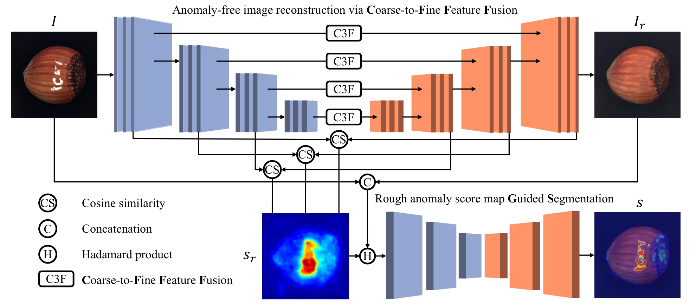
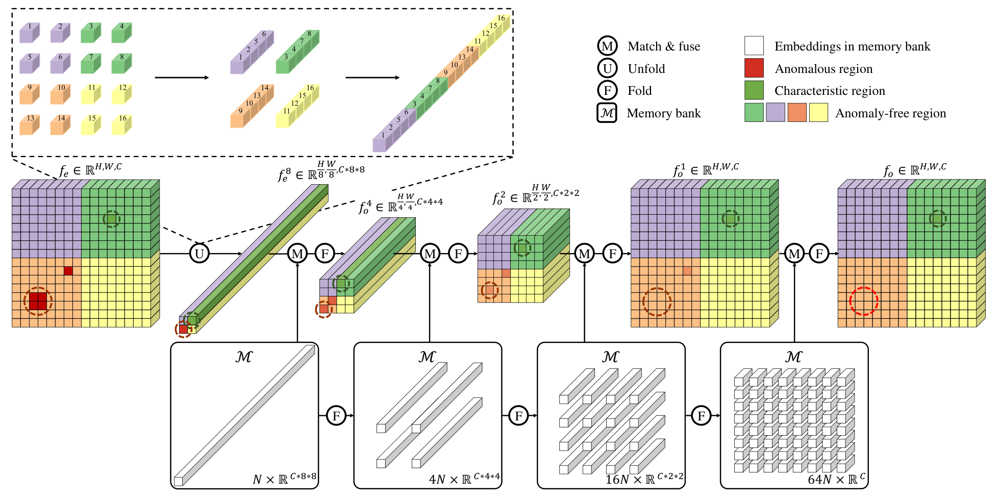

<div align="center">

# C3F

### Anomaly or Characteristic: Memory-based Coarse-to-Fine Feature Fusion for Industrial Anomaly Detection

**Huachao Zhu\*, Zelong Liu\*, Zhichao Sun, Wenhui Dong, Xin Xiao, Zerui Zhang, Yongchao Xu†**

Wuhan University · **IEEE Transactions on Multimedia, 2026**

[**Paper**](https://doi.org/10.1109/TMM.2026.3668690) · [**Method**](#method) · [**Getting started**](#getting-started) · [**Citation**](#citation)

<sub>* Equal contribution. † Corresponding author.</sub>

</div>

**Reconstruct defects while preserving the characteristics that make each normal object unique.**
C3FGS combines memory-based coarse-to-fine feature fusion (**C3F**) with anomaly-map-guided segmentation (**GS**) for unsupervised industrial anomaly detection and localization. Training uses normal images and synthesized anomalies; inference produces a reconstruction and an anomaly map.

<p align="center">
  
</p>

*Framework overview from Figure 2 of the [paper](https://doi.org/10.1109/TMM.2026.3668690).*

## Method

Normal objects can contain distinctive details that resemble defects. C3F replaces ordinary encoder–decoder skip connections with memory-guided fusion at progressively finer spatial scales. It suppresses anomalous features while retaining normal variation. GS then combines the input image, its reconstruction, and a rough feature-discrepancy map to localize defects.

- **Memory at multiple scales:** coreset embeddings represent normal features at different levels of granularity.
- **Coarse-to-fine fusion:** larger windows address larger anomalies; finer windows preserve local characteristics.
- **Guided segmentation:** the rough anomaly map directs the segmentation network toward suspicious regions.

<p align="center">
  
</p>

*Memory-based C3F module from Figure 3 of the paper. [Figure sources](assets/paper/README.md).*

## Paper results

Results reported in Tables I and III of the paper, using **256 × 256** input images. All values are percentages.

| Dataset | Image AUROC ↑ | Pixel AUROC ↑ | Pixel AUPRO ↑ |
|:--|--:|--:|--:|
| MVTec-AD | **99.66** | **98.86** | — |
| VisA | **98.25** | — | **95.25** |

These are the published results. The current `main` implementation and updated foreground masks have not yet undergone a complete benchmark reproduction.

## Getting started

### 1. Install

Use Python **3.10+**. For GPU training, install a PyTorch/torchvision build compatible with your CUDA environment.

```bash
git clone --branch main https://github.com/LZL501/c3f_industrial_anomaly_detection.git
cd c3f_industrial_anomaly_detection
python -m venv .venv
source .venv/bin/activate
pip install -r requirements.txt
```

The backbone and perceptual network use pretrained torchvision weights, which are downloaded on first use unless already cached. The small LPIPS calibration weights are included in `assets/lpips/vgg.pth`.

### 2. Prepare data and foreground masks

Download [MVTec-AD](https://www.mvtec.com/company/research/datasets/mvtec-ad) and [VisA](https://github.com/amazon-science/spot-diff). For VisA, retain the official `split_csv/1cls.csv` one-class split. Download the DTD textures used for synthetic anomaly generation:

```bash
bash scripts/download_dtd.sh
```

Keep original images and training foreground masks in **separate directories**:

```text
.
├── data/
│   ├── MVTec-AD/
│   │   └── <category>/{train/good,test,ground_truth}/
│   ├── VisA/
│   │   ├── split_csv/1cls.csv
│   │   └── <category>/Data/{Images,Masks}/
│   └── dtd/images/
├── mvtec-foreground/
│   └── <category>/train/foreground/<image-stem>.png
└── visa-foreground/
    └── <category>/Data/Foreground/Normal/<image-stem>.png
```

Foreground masks are binary PNGs at the source image dimensions: **white for physical foreground, black for background**. A VisA source such as `Normal/001.JPG` maps to `Normal/001.png` in the mask directory. Object categories require masks; MVTec texture categories use full-image foreground. Missing, unreadable, or empty required masks stop training.

Dataset images and prepared foreground masks are not bundled with this code repository. Prepare the masks before training. See the [foreground preparation guide](docs/foreground_setup.md) for baseline generation commands and review requirements; the [VisA baseline and refinement notes](docs/visa_foreground_baseline.md) describe the current selection and its validation scope.

### 3. Train a category

**MVTec-AD** — for example, `bottle`:

```bash
python tools/train.py --config configs/mvtec.yaml \
  --data-root data/MVTec-AD --foreground-root mvtec-foreground \
  --texture-root data/dtd/images --category bottle --device cuda:0
```

**VisA** — for example, `candle`:

```bash
python tools/train.py --config configs/visa.yaml \
  --data-root data/VisA --foreground-root visa-foreground \
  --texture-root data/dtd/images --category candle --device cuda:0
```

Replace `--category` to train another category. Paths can also be set in the YAML configuration. Dotted overrides control individual settings, for example `train.epochs=100`.

Training saves `config.yaml`, `metrics.jsonl`, `last.pth`, `best.pth`, and TensorBoard logs under `runs/<experiment>_<category>/`. Resume with `--resume runs/<experiment>_<category>/last.pth`, and inspect logs with:

```bash
tensorboard --logdir runs
```

### 4. Evaluate

```bash
python tools/eval.py --config configs/mvtec.yaml \
  --checkpoint runs/mvtec_c3f_bottle/best.pth \
  --data-root data/MVTec-AD --category bottle --device cuda:0

python tools/eval.py --config configs/visa.yaml \
  --checkpoint runs/visa_c3f_candle/best.pth \
  --data-root data/VisA --category candle --device cuda:0
```

Use the same architecture settings as the training run; its saved `config.yaml` can be passed to `--config`. Evaluation reports image AUROC, pixel AUROC, and AUPRO as fractions in `[0, 1]`. The MVTec template selects pixel AUROC for localization; the VisA template selects AUPRO. Evaluation uses original anomaly annotations and does not require training foreground masks or DTD textures.

## Implementation notes

The `main` branch provides a plain PyTorch training and evaluation implementation. The earlier PyTorch Lightning entry points and configurations remain on [`master`](https://github.com/LZL501/c3f_industrial_anomaly_detection/tree/master).

The current defaults use a frozen ImageNet `IMAGENET1K_V1` Wide-ResNet50-2 encoder, four feature stages, memory folds `[8, 4, 2, 1]`, and guided segmentation. Foreground masks restrict texture and structure pseudo anomalies to the object.

**Memory configuration:** `train.freeze_codebook: true` follows the earlier released training path. Set `train.freeze_codebook=false` to train the memory embeddings as described in the paper. Record this choice when comparing experiments.

| Location | Contents |
|:--|:--|
| `c3f/models/` | Encoder, memory fusion, decoder, segmentation, and losses |
| `c3f/data/` | Dataset loaders and synthetic anomalies |
| `c3f/engine.py` | Training, evaluation, and checkpoint handling |
| `configs/` | MVTec-AD and VisA experiment templates |
| `tools/` | Training, evaluation, and foreground preparation commands |
| `docs/` | Foreground preparation, provenance, and review limits |

Run the implementation checks with `python -m pytest -q`.

## Citation

```bibtex
@article{zhu2026c3f,
  title   = {Anomaly or Characteristic: Memory-based Coarse-to-Fine Feature Fusion for Industrial Anomaly Detection},
  author  = {Zhu, Huachao and Liu, Zelong and Sun, Zhichao and Dong, Wenhui and Xiao, Xin and Zhang, Zerui and Xu, Yongchao},
  journal = {IEEE Transactions on Multimedia},
  year    = {2026},
  doi     = {10.1109/TMM.2026.3668690}
}
```
